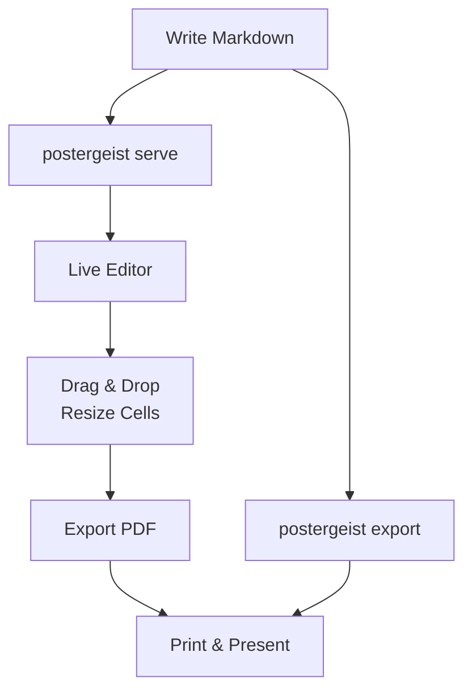
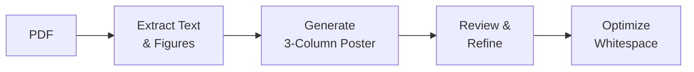

## What is Postergeist?

<!-- col: 0, h: 0.55 -->

A tool that turns **Markdown files** into beautiful, print-ready academic posters.

> Write content in Markdown. Get a poster you can print at any conference.

- **No LaTeX** — just Markdown + YAML
- **Live preview** with drag-and-drop editing
- **PDF export** at exact poster dimensions
- **5 built-in themes** with full customization
- **AI-powered** paper-to-poster generation


## Workflow

<!-- col: 0, h: 0.8 -->



Everything saves back to your `.md` file automatically.


## Content Features

<!-- col: 0, h: 0.78, split: true -->

Write your poster content using standard Markdown:

- **Tables** — standard pipe syntax with auto-styling
- **Math** — inline `$E=mc^2$` and display `$$...$$` via KaTeX
- **Mermaid** — flowcharts, sequence diagrams, and more
- **Images** — with automatic captions from alt text
- **Image grids** — `{grid:N}` for side-by-side figures
- **Split cells** — `


|||

` for side-by-side content
- **Blockquotes** — highlighted key findings
- **Code blocks** — syntax-highlighted snippets


## Cell Placement

<!-- col: 0, h: 0.45 -->

Control layout with HTML comments after each heading:

```
## My Section Title
<!-- col: 1, h: 1.5 -->
```

- `col: N` — target column (0-indexed)
- `h: N` — relative height (default 1.0)
- `split: true` — enable side-by-side mode


## How It Works

<!-- col: 1, h: 0.92 -->

Write a simple Markdown file with YAML frontmatter:

```yaml
---
title: "My Research Poster"
authors:
  - name: "Jane Doe"
    affiliation: "1"
affiliations:
  - key: "1"
    name: "MIT"
poster:
  size: A0-landscape
  template: gradient
  columns: [1, 2, 1]
---
```

Each `## Heading` becomes a cell. Postergeist handles layout, typography, and responsive scaling automatically.


## Interactive Editor

<!-- col: 1, h: 0.82 -->

The `postergeist serve` command starts a live development server with a full visual editor:

| Feature | How |
|---------|-----|
| **Reorder cells** | Drag cell headers |
| **Resize height** | Drag cell bottom edges |
| **Resize columns** | Drag column borders |
| **Resize splits** | Drag split dividers |
| **Resize grids** | Drag between grid images |
| **Split/merge** | Click the split button |
| **Preview mode** | Toggle edit controls off |

All changes are **saved back to the Markdown file** automatically — your source of truth stays in version control.


## Built-in Templates

<!-- col: 1, h: 0.66 -->

| Template | Style | Fonts |
|----------|-------|-------|
| **Classic** | Traditional academic | DM Sans / Source Serif 4 |
| **Modern Dark** | Neon + glassmorphism | Oswald / Montserrat |
| **Modern Light** | Clean, bright variant | Oswald / Montserrat |
| **Minimal** | Elegant, white space | Averia Serif Libre / Geist |
| **Gradient** | Vibrant, rounded cards | Poppins / Lora |

Preview any theme instantly: `?template=modern-dark` in the URL. Create custom themes with a simple YAML file.


## Paper-to-Poster AI

<!-- col: 1, h: 0.82 -->

Postergeist includes a **Claude Code skill** that converts academic PDFs into posters automatically:

```
/paper-to-poster paper.pdf
/paper-to-poster https://arxiv.org/abs/2408.00653
```

The AI pipeline:



- Extracts figures at **300 DPI** with auto-cropped captions
- Generates a full poster using all features: grids, math, mermaid, tables
- Supports **ArXiv URLs** — automatically fetches the PDF
- Reviews for accuracy against the original paper


## Paper Sizes

<!-- col: 2, h: 0.55 -->

Standard academic sizes built-in:

| Size | Dimensions |
|------|-----------|
| A0 landscape | 1189 x 841 mm |
| A0 portrait | 841 x 1189 mm |
| A1–A3 | Both orientations |
| 48x36 | US standard |
| 36x24 | US compact |

Custom sizes: `size: 40x30in`


## Customization

<!-- col: 2, h: 0.65 -->

Every visual property is configurable:

**Colors** — 12 semantic color tokens (primary, secondary, accent, surface, text, header_bg, ...)

**Fonts** — Any Google Font pair for headings and body text

**Layout** — cell radius, shadows, borders, padding, gaps, margins

**Images** — border, radius, grid alignment

Create a `.yaml` theme file and reference it:

```yaml
poster:
  template: my-theme
```


## Smart Scaling

<!-- col: 2, h: 0.46 -->

Postergeist automatically scales content to fit each cell:

- Per-cell font scaling (**0.5x – 1.3x**)
- Split cells use **uniform** scale across halves
- Tables excluded from scale computation
- No manual font size tweaking needed

> Content fills available space without overflowing or leaving gaps.


## Getting Started

<!-- col: 2, h: 0.55 -->

```bash
# Install
uv pip install postergeist

# Create from template
postergeist new my-poster -t gradient

# Start editing
postergeist serve my-poster/poster.md

# Export PDF
postergeist export my-poster/poster.md
```

Requires Python 3.10+ and Playwright for PDF export.


## Why Postergeist?

<!-- col: 2, h: 0.6 -->

| | LaTeX | PowerPoint | **Postergeist** |
|--|-------|------------|----------------|
| **Setup** | Hours | Minutes | Minutes |
| **Version control** | Partial | No | **Full** |
| **Live preview** | No | Yes | **Yes** |
| **Drag & drop** | No | Yes | **Yes** |
| **Themes** | Complex | Manual | **1 line** |
| **AI generation** | No | No | **Yes** |
| **Print quality** | Yes | Variable | **Yes** |

> Markdown in, poster out. No PhD in LaTeX required.

