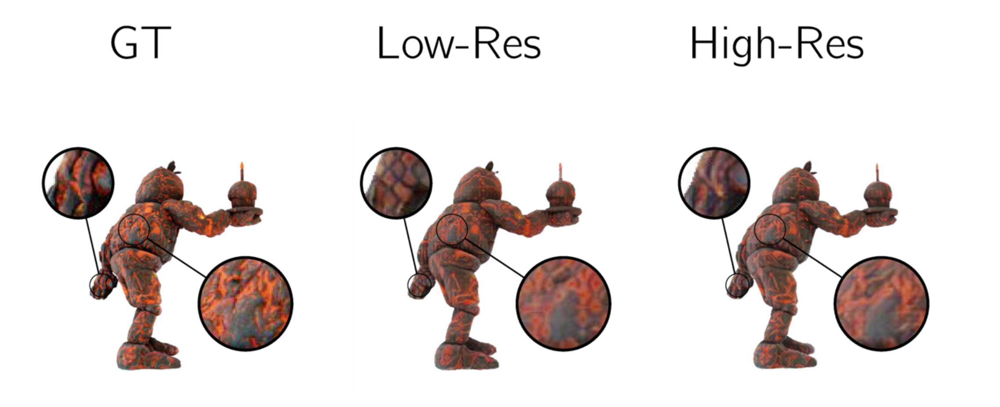
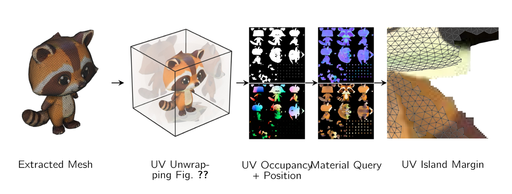
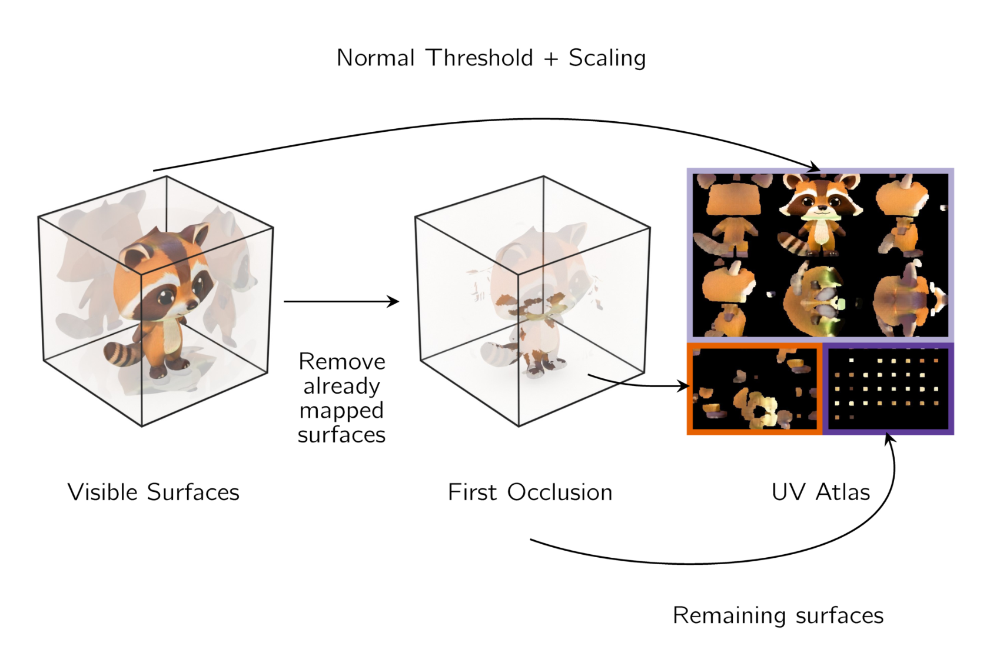
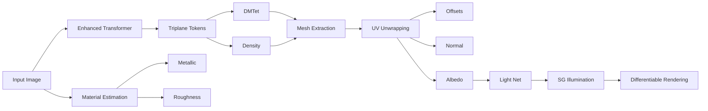

## SF3D Improvements

<!-- col: 0, h: 0.88 -->

Previous methods had several issues:

- Light baked into the albedo, which means relighting is not possible
- Vertex colors cannot capture high resolution textures
- Artifacts from Marching Cubes
- Without any material predictions, relightings remain flat

Our approach addresses all these limitations through explicit material decomposition and UV-unwrapping.

## Speed vs. Quality

<!-- col: 0, h: 0.84 -->

### Performance

Our method achieves state-of-the-art results while being significantly faster than all competing methods.

$$\text{Quality} = \frac{\text{PSNR} \times \text{SSIM}}{\text{Time}}$$

Key findings:

- **3x faster** than nearest competitor
- **Higher PSNR** across all benchmarks
- **Better SSIM** scores on both datasets

## Topology

<!-- col: 0, h: 0.79, split: true -->

### Topology

- No Vertex Deform vs Vertex Deform
- Quad mesh generation
- By explicitly learning vertex deformations, our meshes can capture fine geometry

|||

### Aliasing Issues

- Higher resolution grids lead to less aliasing artifacts

## Decomposition Results

<!-- col: 0, h: 0.89 -->

### Material Decomposition

Our method decomposes rendered images into:

- **Diffuse** albedo (delit)
- **Roughness** map
- **Metallic** map
- **Normal** map
- **Relight 1 & 2** demonstrations

Our method clearly captures the geometry well and creates plausible novel views. It also captures reflections and lighting better due to our explicit inverse rendering.

## Export

<!-- col: 1, h: 1.01 -->

{grid:2:center}

## Method

<!-- col: 1, h: 0.93 -->

**SF3D** - **Fast Generation** Feed-Forward Transformer tuned for explicit mesh generation in 0.3s | **UV Unwrapping** Our implementation enables textures in 200ms | **Architectural Upgrades** Higher resolution triplanes offer more detail

**Delighting** By performing light estimation and inverse rendering, our albedo textures are delit. **Explicit Materials** Additional material parameters enable richer relightings. **SOTA-Performance** SOTA in terms of speed and quality at the same time.

## Comparison - OmniObject

<!-- col: 1 -->

### Results Table

| Method | Time [s] | CD | FS@0.1 | FS@0.2 | FS@0.5 | PSNR | SSIM | LPIPS |
|--------|----------|------|------|------|------|------|------|-------|
| ZeroShape | 0.9 | 0.144 | 0.507 | 0.786 | 0.969 | — | — | — |
| OpenLRM | 2.0 | 0.139 | 0.521 | 0.798 | 0.971 | 13.975 | 0.760 | 0.229 |
| TripoSR | 0.8 | 0.103 | 0.672 | 0.889 | 0.996 | 14.813 | 0.751 | 0.224 |
| CRM | 10.2 | 0.158 | 0.469 | 0.752 | 0.960 | 13.462 | 0.755 | 0.245 |
| InstantMesh | 32.4 | 0.138 | 0.560 | 0.811 | 0.964 | 13.531 | 0.757 | 0.235 |
| **SF3D (Ours)** | **0.3** | **0.089** | **0.731** | **0.922** | **0.990** | **15.138** | **0.785** | **0.200** |

## Comparison - GSO

<!-- col: 2, h: 0.73 -->

### Results Table

| Method | Time [s] | CD | FS@0.1 | FS@0.2 | FS@0.5 |
|--------|----------|------|------|------|------|
| ZeroShape | 0.9 | 0.160 | 0.489 | 0.759 | 0.952 |
| OpenLRM | 2.0 | 0.160 | 0.472 | 0.751 | 0.954 |
| TripoSR | 0.8 | 0.111 | 0.645 | 0.869 | 0.993 |
| LGM | 64.6 | 0.195 | 0.376 | 0.654 | 0.928 |
| CRM | 10.2 | 0.179 | 0.411 | 0.699 | 0.945 |
| InstantMesh | 32.4 | 0.138 | 0.549 | 0.801 | 0.967 |
| LN3Diff | 5.0 | 0.184 | 0.422 | 0.692 | 0.939 |
| 3DTopia-XL | 38.3 | 0.201 | 0.410 | 0.670 | 0.916 |
| **SF3D (Ours)** | **0.3** | **0.090** | **0.710** | **0.907** | **0.986** |

> Our method is the best in terms of speed and reconstruction quality

## References

<!-- col: 2 -->

1. ZeroShape: Zero-shot 3D shape generation from single images
2. OpenLRM: Open-source Large Reconstruction Model
3. TripoSR: Fast 3D reconstruction from single images
4. LGM: Large Multi-View Gaussian Model
5. CRM: Convolutional Reconstruction Model
6. InstantMesh: Efficient 3D Mesh Generation
7. LN3Diff: Scalable Latent Neural Fields Diffusion
8. 3DTopia-XL: Scaling High-quality 3D Asset Generation

**Acknowledgements:** We thank the Stability AI team for support and compute resources.

